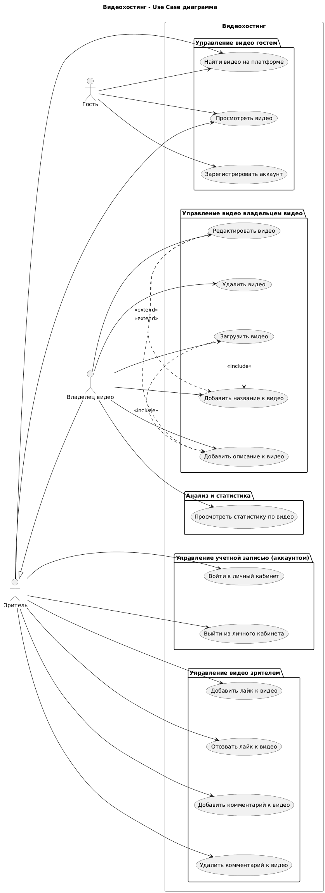
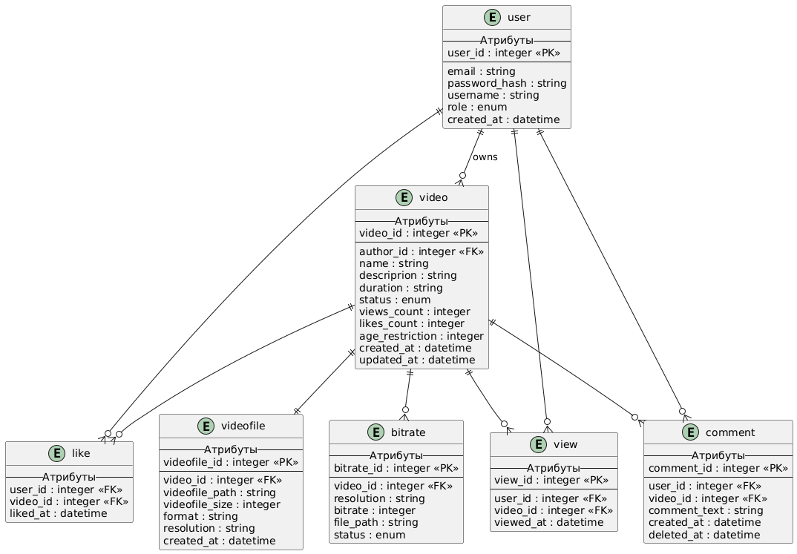
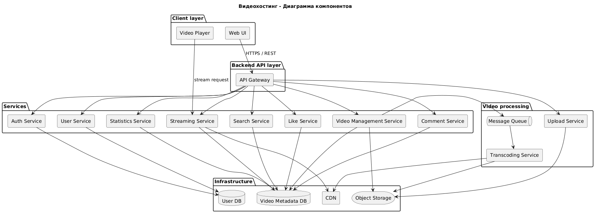
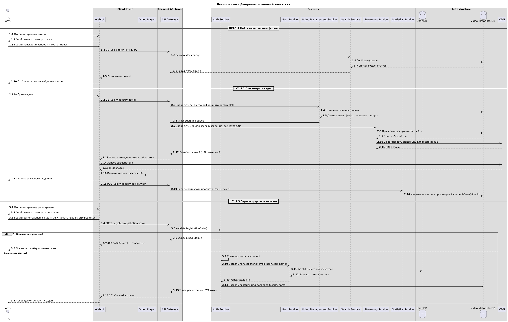
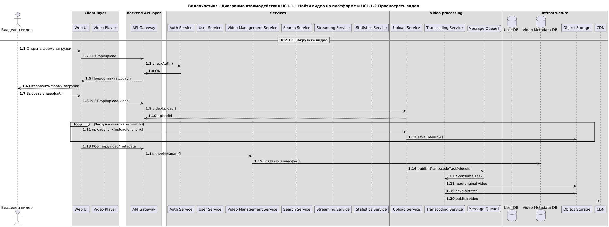
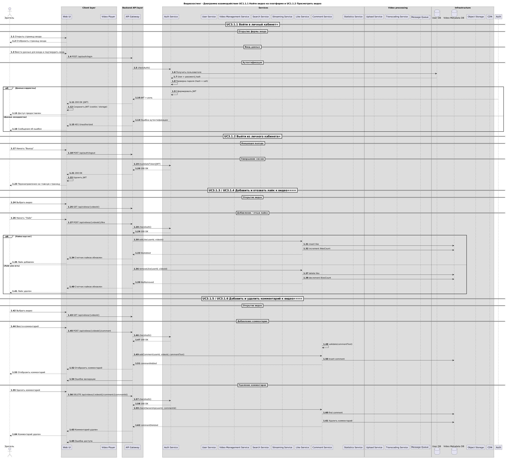
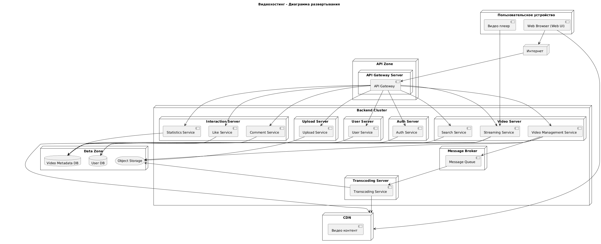

# Спецификация программных требований к платформе видеохостинга <!-- omit in toc --> 

|ID      |SRS-VIDEOHOSTING-01                                              |
|:-------|:----------------------------------------------------------------|
|Название|Спецификация программных требований к платформе видеохостинга    |
|Версия  |1.0                                                              |
|Дата    |09.02.2026                                                       |

**История изменений**

|Дата      |Версия |Описание                                                             |Автор     |
|:---------|:------|:--------------------------------------------------------------------|:---------|
|09.02.2026|1.0    |Создана первая версия документа                                      |Белых И.А.|
|          |       |                                                                     |          |
|          |       |                                                                     |          |
|          |       |                                                                     |          |
|          |       |                                                                     |          |

## Содержание <!-- omit in toc -->

- [Бизнес-требования](#бизнес-требования)
- [Пользовательские истории](#пользовательские-истории)
  - [Пользовательские истории незарегистрированного пользователя (гость)](#пользовательские-истории-незарегистрированного-пользователя-гость)
    - [Эпик 1.1 Управление видео гостем](#эпик-11-управление-видео-гостем)
  - [Пользовательские истории зарегистрированного пользователя (владелец видео)](#пользовательские-истории-зарегистрированного-пользователя-владелец-видео)
    - [Эпик 2.1 Управление учетной записью (аккаунтом)](#эпик-21-управление-учетной-записью-аккаунтом)
    - [Эпик 2.2 Управление видео владельцем видео](#эпик-22-управление-видео-владельцем-видео)
    - [Эпик 2.3 Анализ и статистика](#эпик-23-анализ-и-статистика)
  - [Пользовательские истории зарегистрированного пользователя (зритель)](#пользовательские-истории-зарегистрированного-пользователя-зритель)
    - [Эпик 3.1 Управление учетной записью (аккаунтом)](#эпик-31-управление-учетной-записью-аккаунтом)
    - [Эпик 3.2 Управление видео зрителем](#эпик-32-управление-видео-зрителем)
- [Варианты использования](#варианты-использования)
  - [Варианты использования незарегистрированного пользователя (гость)](#варианты-использования-незарегистрированного-пользователя-гость)
  - [Варианты использования зарегистрированного пользователя (владелец видео)](#варианты-использования-зарегистрированного-пользователя-владелец-видео)
  - [Варианты использования зарегистрированного пользователя (зритель)](#варианты-использования-зарегистрированного-пользователя-зритель)
- [Диаграмма вариантов использования](#диаграмма-вариантов-использования)
- [Описание вариантов использования](#описание-вариантов-использования)
  - [Описание вариантов использования незарегистрированного пользователя (гость)](#описание-вариантов-использования-незарегистрированного-пользователя-гость)
    - [UC1.1.1 Найти видео на платформе](#uc111-найти-видео-на-платформе)
    - [UC1.1.2 Просмотреть видео](#uc112-просмотреть-видео)
    - [UC1.1.3 Зарегистрировать аккаунт](#uc113-зарегистрировать-аккаунт)
  - [Описание вариантов использования зарегистрированного пользователя (владелец видео)](#описание-вариантов-использования-зарегистрированного-пользователя-владелец-видео)
    - [UC2.1.1 Загрузить видео](#uc211-загрузить-видео)
    - [UC2.1.4 Удалить видео](#uc214-удалить-видео)
    - [UC2.1.5 Редактировать видео](#uc215-редактировать-видео)
    - [UC2.2.1 Просмотреть статистику по видео](#uc221-просмотреть-статистику-по-видео)
  - [Описание вариантов использования зарегистрированного пользователя (зритель)](#описание-вариантов-использования-зарегистрированного-пользователя-зритель)
    - [UC3.1.1 Войти в личный кабинет](#uc311-войти-в-личный-кабинет)
    - [UC3.1.2 Выйти из личного кабинета](#uc312-выйти-из-личного-кабинета)
    - [UC3.1.3 Добавить лайк к видео](#uc313-добавить-лайк-к-видео)
    - [UC3.1.4 Отозвать лайк к видео](#uc314-отозвать-лайк-к-видео)
    - [UC3.1.5 Добавить комментарий к видео](#uc315-добавить-комментарий-к-видео)
    - [UC3.1.6 Удалить комментарий к видео](#uc316-удалить-комментарий-к-видео)
- [Функциональные требования](#функциональные-требования)
  - [Управление видео (гость)](#управление-видео-гость)
  - [Регистрация и аутентификация](#регистрация-и-аутентификация)
  - [Управление видео (владелец видео)](#управление-видео-владелец-видео)
  - [Управление видео (зритель)](#управление-видео-зритель)
- [Нефункциональные требования](#нефункциональные-требования)
- [ER-диаграмма](#er-диаграмма)
- [BPMN-диаграмма](#bpmn-диаграмма)
- [Диаграмма компонентов](#диаграмма-компонентов)
- [Назначение компонентов платформы видеохостинга](#назначение-компонентов-платформы-видеохостинга)
- [Диаграмма взаимодействия](#диаграмма-взаимодействия)
  - [Диаграмма взаимодействия гостя](#диаграмма-взаимодействия-гостя)
  - [Диаграмма взаимодействия владельца видео](#диаграмма-взаимодействия-владельца-видео)
  - [Диаграмма взаимодействия зрителя](#диаграмма-взаимодействия-зрителя)
- [Диаграмма развертывания](#диаграмма-развертывания)
- [Swagger (OpenAPI)](#swagger-openapi)
  - [Структура хранения данных](#структура-хранения-данных)
  - [Взаимодействие с API](#взаимодействие-с-api)
  - [Действия API](#действия-api)
  - [HTTP методы API](#http-методы-api)

## Бизнес-требования

**BR-1** Незарегистрированный пользователь (гость) должен иметь возможность просматривать и делиться видео  
**BR-2** Владелец видео должен иметь возможность быстро и удобно загружать видео любого размера  
**BR-3** Зритель должен иметь возможность просматривать и делиться видео без регистрации, а при регистрации оценивать и оставлять комментарии к видео  

## Пользовательские истории

### Пользовательские истории незарегистрированного пользователя (гость)

#### Эпик 1.1 Управление видео гостем

|ID     |US-1.1.1 Поиск видео                                                                    |
|:------|:---------------------------------------------------------------------------------------|
|Как    |гость                                                                                   |
|Я хочу |искать видео без регистрации                                                            |
|Чтобы  |быстро находить необходимую мне информацию и не тратить время на регистрацию/авторизацию|

|ID     |US-1.1.2 Просмотр видео                                                                 |
|:------|:---------------------------------------------------------------------------------------|
|Как    |гость                                                                                   |
|Я хочу |просматривать видео без регистрации                                                     |
|Чтобы  |быстро получать необходимую мне информацию и не тратить время на регистрацию/авторизацию|

|ID     |US-1.1.3 Регистрация аккаунта                                                           |
|:------|:---------------------------------------------------------------------------------------|
|Как    |гость                                                                                   |
|Я хочу |зарегистрироваться на платформе                                                         |
|Чтобы  |создать аккаунт, личный кабинет и быстро загружать видео                                |

### Пользовательские истории зарегистрированного пользователя (владелец видео)

#### Эпик 2.1 Управление учетной записью (аккаунтом)

|ID     |US-2.1.1 Вход в личный кабинет                                                          |
|:------|:---------------------------------------------------------------------------------------|
|Как    |владелец видео                                                                          |
|Я хочу |входить в личный кабинет                                                                |
|Чтобы  |управлять видео и просматривать статистику                                              |

|ID     |US-2.1.2 Выход из личного кабинет                                                       |
|:------|:---------------------------------------------------------------------------------------|
|Как    |владелец видео                                                                          |
|Я хочу |выходить безопасно из личного кабинета                                                  |
|Чтобы  |защитить свой аккаунт от несанкционированного доступа                                   |

#### Эпик 2.2 Управление видео владельцем видео

|ID     |US-2.1.3 Загрузка видео                                                                 |
|:------|:---------------------------------------------------------------------------------------|
|Как    |владелец видео                                                                          |
|Я хочу |загружать видео на свой канал                                                           |
|Чтобы  |публиковать контент на своем канали для просмотра другими пользователями                |

|ID     |US-2.1.4 Добавление название и описания к видео                                         |
|:------|:---------------------------------------------------------------------------------------|
|Как    |владелец видео                                                                          |
|Я хочу |добавлять и изменять название, описание к видео во время или после его загрузки         |
|Чтобы  |сделать видео привлекательным, понятным для поиска другими пользователями               |

|ID     |US-2.1.5 Удаление видео                                                                 |
|:------|:---------------------------------------------------------------------------------------|
|Как    |владелец видео                                                                          |
|Я хочу |удалять видео со своего канала                                                          |
|Чтобы  |убрать неудачный или нерелевантный контент, а также освободить место                    |

|ID     |US-2.1.6 Редактирование видео                                                           |
|:------|:---------------------------------------------------------------------------------------|
|Как    |владелец видео                                                                          |
|Я хочу |редактировать видео на своем канале                                                     |
|Чтобы  |изменять название, описание уже загруженного видео                                      |

#### Эпик 2.3 Анализ и статистика

**US-2.3.1** Просмотр статистики по видео (просмотры, лайки)  

|ID     |US-2.3.1 Просмотр статистики по видео (просмотры, лайки)                                |
|:------|:---------------------------------------------------------------------------------------|
|Как    |владелец видео                                                                          |
|Я хочу |просматривать статистику по видео (просмотры, лайки) на своем канале                    |
|Чтобы  |анализировать рейтинги, популярность и лучше понимать предпочтения аудитории            |

### Пользовательские истории зарегистрированного пользователя (зритель)

#### Эпик 3.1 Управление учетной записью (аккаунтом)

|ID     |US-3.1.1 Вход в личный кабинет                                                          |
|:------|:---------------------------------------------------------------------------------------|
|Как    |зритель                                                                                 |
|Я хочу |входить в личный кабинет                                                                |
|Чтобы  |чтобы добавлять комментарии, ставить лайки                                              |

|ID     |US-3.1.2 Выход из личного кабинет                                                       |
|:------|:---------------------------------------------------------------------------------------|
|Как    |зритель                                                                                 |
|Я хочу |выходить безопасно из личного кабинета                                                  |
|Чтобы  |защитить свой аккаунт от несанкционированного доступа                                   |

#### Эпик 3.2 Управление видео зрителем

|ID     |US-3.2.1 Добавление лайка к видео                                                       |
|:------|:---------------------------------------------------------------------------------------|
|Как    |зритель                                                                                 |
|Я хочу |добавлять лайк к видео                                                                  |
|Чтобы  |выразить поддержку владельцу видео                                                      |

|ID     |US-3.2.2 Отзыв лайка к видео                                                            |
|:------|:---------------------------------------------------------------------------------------|
|Как    |зритель                                                                                 |
|Я хочу |отзывать лайк к видео, если лайк был поставлен ошибочно или видео не нравится, неактуально, нерелевантно|
|Чтобы  |удалить видео из списка «Понравившиеся»                                                 |

|ID     |US-3.2.3 Добавление комментария к видео                                                 |
|:------|:---------------------------------------------------------------------------------------|
|Как    |зритель                                                                                 |
|Я хочу |добавлять комментарии к видео                                                           |
|Чтобы  |высказать свое мнение, задать вопрос владельцу видео или пообщаться с аудиторией        |

|ID     |US-3.2.4 Удаление комментария к видео                                                   |
|:------|:---------------------------------------------------------------------------------------|
|Как    |зритель                                                                                 |
|Я хочу |удалять комментарии к видео                                                             |
|Чтобы  |исправить ошибку, убрать неактульный или случайно добавленный комментарий               |

## Варианты использования

### Варианты использования незарегистрированного пользователя (гость)
 
[UC1.1.1 Найти видео на платформе](#uc111-найти-видео-на-платформе)  
[UC1.1.2 Просмотреть видео](#uc112-просмотреть-видео)  
[UC1.1.3 Зарегистрировать аккаунт](#uc113-зарегистрировать-аккаунт)  

### Варианты использования зарегистрированного пользователя (владелец видео)

[UC2.1.1 Загрузить видео](#uc211-загрузить-видео)  
[UC2.1.2 Добавить название к видео](#uc211-загрузить-видео)  
[UC2.1.3 Добавить описание к видео](#uc211-загрузить-видео)  
[UC2.1.4 Удалить видео](#uc214-удалить-видео)  
[UC2.1.5 Редактировать видео](#uc215-редактировать-видео)  
[UC2.2.1 Просмотреть статистику по видео](#uc221-просмотреть-статистику-по-видео)   
 
### Варианты использования зарегистрированного пользователя (зритель)

[UC3.1.1 Войти в личный кабинет](#uc311-войти-в-личный-кабинет)  
[UC3.1.2 Выйти из личного кабинета](#uc312-выйти-из-личного-кабинета)  
[UC3.1.3 Добавить лайк к видео](#uc313-добавить-лайк-к-видео)  
[UC3.1.4 Отозвать лайк к видео](#uc314-отозвать-лайк-к-видео)  
[UC3.1.5 Добавить комментарий к видео](#uc315-добавить-комментарий-к-видео)  
[UC3.1.6 Удалить комментарий к видео](#uc316-удалить-комментарий-к-видео)   

## Диаграмма вариантов использования

## Описание вариантов использования

### Описание вариантов использования незарегистрированного пользователя (гость)

#### UC1.1.1 Найти видео на платформе

|ID                      |UC1.1.1                                                                                 |
|:-----------------------|:---------------------------------------------------------------------------------------|
|Наименование            |Найти видео на платформе                                                                |
|Краткое описание        |Пользователь ищет видео на платформе                                                    |
|Акторы (основные)       |Гость                                                                                   |
|Акторы (вторичные)      |Отсутствуют                                                                             |
|Начальное состояние     |Пользователь находится на платформе (авторизация необязательна)                         |
|Основной сценарий       |1. Пользователь открывает страницу поиска 2. Система отображает страницу поиска 3. Пользователь вводит поисковый запрос (название, ключевые слова) 4. Пользователь иницирует поиск 5. Система осуществляет поиск и отображает список найденных видео с основной информацией и статусом доступности                                                                                                       |
|Альтернативный сценарий |5а.1. По запросу ничего не найдено - отображается сообщение об отсутствии результатов   |
|Негативный сценарий     |5б.1. Нет сетевого подключения - отображается сообщение "Ошибка сети, попробуйте позже" |
|Конечное состояние      |Пользователю отображен список найденных видео                                           |
|Результат               |Видео найдено и доступно для просмотра                                                  |

#### UC1.1.2 Просмотреть видео

|ID                      |UC1.1.2                                                                                 |
|:-----------------------|:---------------------------------------------------------------------------------------|
|Наименование            |Просмотреть видео                                                                       |
|Краткое описание        |Пользователь просматривает видео                                                        |
|Акторы (основные)       |Гость                                                                                   |
|Акторы (вторичные)      |Отсутствуют                                                                             |
|Начальное состояние     |1. Пользователь находится на платформе (авторизация необязательна) 2. Видео доступно для просмотра 3. Подготовлены или в процессе подготовки битрейты                                                                                                          |
|Основной сценарий       |1. Пользователь выбирает видео из списка или результатов поиска 2. Система открывает страницу видео с плеером 3. Система обеспечивает воспроизведение видео в доступным качеством 4. Система фиксирует просмотр и обновляет статистику по каждому битрейту                                                                                                          |
|Альтернативный сценарий |3а.1. Видео недоступно (по правам, возрасту или нет доступных битрейтов) - отображается сообщение об ошибке|
|Негативный сценарий     |3б.1. Сбой CDN\сети - отображается сообщение "Ошибка воспроизведения"                   |
|Конечное состояние      |Видео воспроизведено, счетчик просмотров увеличен                                       |
|Результат               |Видео воспроизведено                                                                    |
 

#### UC1.1.3 Зарегистрировать аккаунт

|ID                      |UC1.1.3                                                                                 |
|:-----------------------|:---------------------------------------------------------------------------------------|
|Наименование            |Зарегистрировать аккаунт                                                                |
|Краткое описание        |Незарегистрированный пользователь создает новый аккаунт на платформе видеохостинга      |
|Акторы (основные)       |Гость                                                                                   |
|Акторы (вторичные)      |Отсутствуют                                                                             |
|Начальное состояние     |Пользователь не авторизован                                                             |
|Основной сценарий       |1. Пользователь открывает страницу регистрации 2. Система отображает страницу регистрации 3. Пользователь вводит регистрационные данные 4. Пользователь подтверждает регистрацию 5. Система валидирует данные 6. Система создает аккаунт                                                                                                           |
|Альтернативный сценарий |Отсутствует                                                                             |
|Негативный сценарий     |6а.1. Данные некорректны - отображается сообщение об ошибке и предлагает пройти регистрацию повторно|
|Конечное состояние      |Аккаунт создан, пользователь может выполнить                                            |
|Результат               |Пользователь зарегистрировал новый аккаунт на платформе видеохостинга                   |

### Описание вариантов использования зарегистрированного пользователя (владелец видео) 

#### UC2.1.1 Загрузить видео  

|ID                      |UC2.1.1                                                                                 |
|:-----------------------|:---------------------------------------------------------------------------------------|
|Наименование            |Загрузить видео                                                                         |
|Краткое описание        |Пользователь загружает видео и указывает его название и описание                        |
|Акторы (основные)       |Владелец видео                                                                          |
|Акторы (вторичные)      |Отсутствуют                                                                             |
|Начальное состояние     |Пользователь авторизован                                                                |
|Основной сценарий       |1. Пользователь открывает форму загрузки 2. Система отображает форму загрузки 3. Пользователь выбирает видеофайл 4. Система проверяет формат и размер видеофайла 5. Система сохраняет оригинальный файл и создаёт задания на генерацию битрейтов (очередь) 6. Пользователь вводит название 7. Пользователь вводит описание 8. Пользователь инициирует загрузку 9. Система сохраняет видео                                                                                                             |
|Альтернативный сценарий |Отсутствует                                                                             |
|Негативный сценарий     |5а.1. Неподдерживаемый формат - загрузка отклонена  5б.1. Размер превышает лимит - загрузка отклонена 5в.1. Сбой сети или обработчика - видео не сохранено, отображается сообщение об ошибке                                                                       |
|Конечное состояние      |Видео загружено и сохранено, задачи на битрейты созданы                                 |
|Результат               |Видео загружено и доступно для просмотра по мере готовности битрейтов                   |       

#### UC2.1.4 Удалить видео  

|ID                      |UC2.1.4                                                                                 |
|:-----------------------|:---------------------------------------------------------------------------------------|
|Наименование            |Удалить видео                                                                           |
|Краткое описание        |Пользователь удаляет видео со своей странице                                            |
|Акторы (основные)       |Владелец видео                                                                          |
|Акторы (вторичные)      |Отсутствуют                                                                             |
|Начальное состояние     |1. Пользователь авторизован 2. Видео принадлежит пользователю                        |
|Основной сценарий       |1. Пользователь открывает список видео 2. Система отображает список видео 3. Пользователь выбирает видео 4. Пользователь инициирует удаление 5. Система требует подтвердить удаление 6. Пользователь подтверждает удаление 7. Система удаляет видео и связанные с ним данные                                                                                                            |
|Альтернативный сценарий |6а.1. Пользователь отменяет действие - видео не удалено                                 |
|Негативный сценарий     |Отсутствует                                                                             |
|Конечное состояние      |Видео удалено                                                                           |
|Результат               |Видео удалено и не доступно для просмотра                                               |     

#### UC2.1.5 Редактировать видео    

|ID                      |UC2.1.5                                                                                 |
|:-----------------------|:---------------------------------------------------------------------------------------|
|Наименование            |Редактировать видео                                                                     |
|Краткое описание        |Пользователь изменяет информацию о ранее загруженном видео                              |
|Акторы (основные)       |Владелец видео                                                                          |
|Акторы (вторичные)      |Отсутствуют                                                                             |
|Начальное состояние     |1. Пользователь авторизован 2. Видео принадлежит пользователю                        |
|Основной сценарий       |1. Пользователь открывает список видео 2. Система отображает список видео 3. Пользователь выбирает видео 4. Пользователь инициирует редактирование 5. Система включает режим редактирования 6. Пользователь изменяет название и/или описание 7. Пользователь инициирует сохранение 8. Система требует подтвердить сохранение 9. Пользователь подтверждает сохранение 10. Система сохраняет изменения                                                                                                         |
|Альтернативный сценарий |9а.1. Пользователь отменяет действие - данные не сохранены                              |
|Негативный сценарий     |6а.1. Данные некорректны - изменения не приняты                                         |
|Конечное состояние      |Изменения приняты                                                                       |
|Результат               |Информация о видео изменена                                                             |  

#### UC2.2.1 Просмотреть статистику по видео    

|ID                      |UC2.2.1                                                                                 |
|:-----------------------|:---------------------------------------------------------------------------------------|
|Наименование            |Просмотреть статистику по видео                                                         |
|Краткое описание        |Пользователь просматривает показатели популярности видео                                |
|Акторы (основные)       |Владелец видео                                                                          |
|Акторы (вторичные)      |Отсутствуют                                                                             |
|Начальное состояние     |1. Пользователь авторизован 2. Видео существует                                      |
|Основной сценарий       |1. Пользователь открывает список видео 2. Система отображает список видео 3. Пользователь открывает раздел статистики 4. Система отображает просмотры и лайки                                                                                                 |
|Альтернативный сценарий |4а.1. Нет данных - отображается сообщение об отсутствии данных                          |
|Негативный сценарий     |4б.1. Ошибка получения данных                                                           |
|Конечное состояние      |Статистика отображена                                                                   |
|Результат               |Отображается актуальная статистика                                                      |

### Описание вариантов использования зарегистрированного пользователя (зритель) 

#### UC3.1.1 Войти в личный кабинет  

|ID                      |UC3.1.1                                                                                 |
|:-----------------------|:---------------------------------------------------------------------------------------|
|Наименование            |Войти в личный кабинет                                                                  |
|Краткое описание        |Пользователь проходит аутентификацию для доступа к личному кабинету                     |
|Акторы (основные)       |Владелец видео, зритель                                                                 |
|Акторы (вторичные)      |Отсутствуют                                                                             |
|Начальное состояние     |Пользователь зарегистрирован и не авторизован                                           |
|Основной сценарий       |1. Пользователь открывает страницу входа 2. Система отображает страницу входа 3. Пользователь вводит данные для входа 4. Пользователь подтверждает вход 5. Система проверяет данные 6. Система предоставляет доступ                                                                                                            |
|Альтернативный сценарий |Отсутствует                                                                             |
|Негативный сценарий     |6а. Данные некорректны 1. Система выводит сообщение об ошибке и предлагает пройти авторизацию повторно|
|Конечное состояние      |Пользователь авторизован                                                                |
|Результат               |Пользователь авторизован                                                                |  

#### UC3.1.2 Выйти из личного кабинета  

|ID                      |UC3.1.2                                                                                 |
|:-----------------------|:---------------------------------------------------------------------------------------|
|Наименование            |Выйти из личного кабинета                                                               |
|Краткое описание        |Пользователь завершает текущую сессию работы                                            |
|Акторы (основные)       |Владелец видео, зритель                                                                 |
|Акторы (вторичные)      |Отсутствуют                                                                             |
|Начальное состояние     |Пользователь авторизован                                                                |
|Основной сценарий       |1. Пользователь выходит из личного кабинета 2. Система завершает сессию 3. Система перенаправляет на главную страницу                                                                                                          |
|Альтернативный сценарий |Отсутствует                                                                             |
|Негативный сценарий     |Отсутствует                                                                             |
|Конечное состояние      |Сессия завершена                                                                        |
|Результат               |Сессия завершена, доступ закрыт                                                         |  

#### UC3.1.3 Добавить лайк к видео

|ID                      |UC3.1.3                                                                                 |
|:-----------------------|:---------------------------------------------------------------------------------------|
|Наименование            |Добавить лайк к видео                                                                   |
|Краткое описание        |Пользователь завершает текущую сессию работы                                            |
|Акторы (основные)       |Владелец видео, зритель                                                                 |
|Акторы (вторичные)      |Отсутствуют                                                                             |
|Начальное состояние     |1. Пользователь авторизован 2. Видео доступно для просмотра                          |
|Основной сценарий       |1. Пользователь открывает видео 2. Система отображает видео 3. Пользователь лайкает видео 4. Система фиксирует лайк и обновляет счетчик лайков                                                                                                            |
|Альтернативный сценарий |4а. Пользователь повторно лайкает видео 1. Система отзывает лайк и обновляет счетчик лайков                                                                                                            |
|Негативный сценарий     |Отсутствует                                                                             |
|Конечное состояние      |Лайк добавлен, счетчик лайков обновлен                                                  |
|Результат               |Кол-во лайков изменено                                                                  | 

#### UC3.1.4 Отозвать лайк к видео  

|ID                      |UC3.1.4                                                                                 |
|:-----------------------|:---------------------------------------------------------------------------------------|
|Наименование            |Отозвать лайк к видео                                                                   |
|Краткое описание        |Пользователь отзывает лайк к видео                                                      |
|Акторы (основные)       |Владелец видео, зритель                                                                 |
|Акторы (вторичные)      |Отсутствуют                                                                             |
|Начальное состояние     |1. Пользователь авторизован 2. Видео доступно для просмотра 3. Пользователь ранее поставил лайк к видео                                                                                                             |
|Основной сценарий       |1. Пользователь открывает видео 2. Система отображает видео 3. Пользователь повторно лайкает видео 4. Система отзывает лайк и обновляет счетчик лайков                                                                                                    |
|Альтернативный сценарий |Отсутствует                                                                             |
|Негативный сценарий     |Отсутствует                                                                             |
|Конечное состояние      |Лайк отозван, счетчик лайков обновлен                                                   |
|Результат               |Кол-во лайков изменено                                                                  |    

#### UC3.1.5 Добавить комментарий к видео  

|ID                      |UC3.1.5                                                                                 |
|:-----------------------|:---------------------------------------------------------------------------------------|
|Наименование            |Добавить комментарий к видео                                                            |
|Краткое описание        |Пользователь добавляет комментарий под видео                                            |
|Акторы (основные)       |Владелец видео, зритель                                                                 |
|Акторы (вторичные)      |Отсутствуют                                                                             |
|Начальное состояние     |1. Пользователь авторизован 2. Видео доступно для просмотра                                                                                                         |
|Основной сценарий       |1. Пользователь открывает видео 2. Система отображает видео 3. Пользователь добавляет комментарий 4. Система отображает комментарий                                                                                                       |
|Альтернативный сценарий |Отсутствует                                                                             |
|Негативный сценарий     |4а.1. Комментарий пустой - ошибка валидации                                             |
|Конечное состояние      |Комментарий добавлен                                                                    |
|Результат               |Комментарий добавлен и отображается под видео                                           |

#### UC3.1.6 Удалить комментарий к видео  

|ID                      |UC3.1.6                                                                                 |
|:-----------------------|:---------------------------------------------------------------------------------------|
|Наименование            |Удалить комментарий к видео                                                             |
|Краткое описание        |Пользователь удаляет собственный комментарий под видео                                  |
|Акторы (основные)       |Владелец видео, зритель                                                                 |
|Акторы (вторичные)      |Отсутствуют                                                                             |
|Начальное состояние     |1. Пользователь авторизован 2. Видео доступно для просмотра   3. Комментарий принадлежит пользователю                                                                                                      |
|Основной сценарий       |1. Пользователь открывает видео 2. Система отображает видео 3. Пользователь находит свой комментарий 4. Пользователь инициирует удаление 5. Система требует подтвердить удаление 6. Пользователь подтверждает удаление 7. Система удаляет комментарий                                                                                                       |
|Альтернативный сценарий |6а.1. Пользователь отменяет действие 6а.2. Система сохраняет комментарий                                                                                                       |
|Негативный сценарий     |Отсутствует                                                                             |
|Конечное состояние      |Комментарий удален                                                                      |
|Результат               |Комментарий удален и не отображается под видео                                          |

## Функциональные требования

### Управление видео (гость)

|ID     |Требование                                                                                |Источник                     |Приоритет|Тип               |
|:------|:---------------------------------------------------------------------------------------- |:----------------------------|:--------|:-----------------|
|FR-1.1 |Система должна предоставлять предоставлять пользователю страницу поиска видео             |UC1.1.1                      |Высокий  |Пользовательское  |
|FR-1.2 |Система должна выполнять поиск видео по названию и ключевым словам                        |UC1.1.1                      |Высокий  |Пользовательское  |
|FR-1.3 |Система должна отображать список видео, соответствующих поисковому запросу                |UC1.1.1                      |Высокий  |Пользовательское  |
|FR-1.4 |Система должна отображать соответствующее сообщение при отсутствии результатов поиска     |UC1.1.1                      |Средний  |Пользовательское  |
|FR-1.5 |Система должна открывать страницу выбранного видео                                        |UC1.1.2                      |Высокий  |Пользовательское  |
|FR-1.6 |Пользователь должен просматривать видео через встроенный видеоплеер платформы             |UC1.1.1                      |Высокий  |Пользовательское  |
|FR-1.7 |Система должна автоматически воспроизводить видео при открытии страницы                   |UC1.1.2                      |Средний  |Пользовательское  |
|FR-1.8 |Система должна поддерживать воспроизведение в обычном и ускоренном режимах                |UC1.1.2                      |Средний  |Пользовательское  |
|FR-1.9 |Система должна отображать текущее и общее время просмотра                                 |UC1.1.2                      |Средний  |Пользовательское  |
|FR-1.10|Пользователь должен иметь возможность начать просмотр видео с любого момента              |UC1.1.2                      |Высокий  |Пользовательское  |
|FR-1.11|Система должна поддерживать регулировку громкости и отключение звука                      |UC1.1.2                      |Средний  |Пользовательское  |
|FR-1.12|Система должна фиксировать факт просмотра видео                                           |UC1.1.2                      |Высокий  |Системное         |
|FR-1.13|Пользователь должен иметь возможность встраивать видео по ссылке (embed)                  |UC1.1.2                      |Средний  |Бизнес            |
|FR-1.14|Система должна отображать сообщение об ошибке при недоступности видео или битрейтов       |UC1.1.2                      |Средний  |Пользовательское  |
   
### Регистрация и аутентификация   
   
|ID      |Требование                                                                               |Источник                     |Приоритет|Тип               |
|:-------|:----------------------------------------------------------------------------------------|:----------------------------|:--------|:-----------------|
|FR-2.1  |Система должна предоставлять страницу регистрации пользователя                           |UC1.1.3                      |Высокий  |Пользовательское  |
|FR-2.2  |Система должна валидировать регистрационные данные пользователя                          |UC1.1.3                      |Высокий  |Системное         |
|FR-2.3  |Система должна создавать учетную запись пользователя при корректных данных               |UC1.1.3                      |Высокий  |Бизнес            |
|FR-2.4  |Система должна отображать сообщение об ошибке при некорректных данных                    |UC1.1.3                      |Высокий  |Пользовательское  |
|FR-2.5  |Система должна предоставлять форму входа в личный кабинет                                |UC3.1.1                      |Высокий  |Пользовательское  |
|FR-2.6  |Система должна выполнять аутентификацию пользователя                                     |UC3.1.1                      |Высокий  |Системное         |
|FR-2.7  |Система должна предоставлять доступ к личному кабинету при успешной аутентификации       |UC3.1.1                      |Высокий  |Бизнес            |
|FR-2.8  |Система должна завершать пользовательскую сессию при выходе                              |UC3.1.2                      |Высокий  |Системное         |
  
### Управление видео (владелец видео)  
  
|ID      |Требование                                                                               |Источник                     |Приоритет|Тип               |
|:-------|:----------------------------------------------------------------------------------------|:----------------------------|:--------|:-----------------|
|FR-3.1  |Система должна предоставлять форму загрузки видео                                        |UC2.1.1                      |Высокий  |Пользовательское  |
|FR-3.2  |Система должна проверять формат загружаемого видео                                       |UC2.1.1                      |Высокий  |Системное         |
|FR-3.3  |Система должна отклонять загрузку при неподдерживаемом формате                           |UC2.1.1                      |Высокий  |Системное         |
|FR-3.4  |Система должна сохранять оригинальный видеофайл, его название и описание после загрузки  |UC2.1.1 UC2.1.2 UC2.1.3|Высокий  |Системное         |
|FR-3.5  |Система должна инициировать асинхронную обработку видео                                  |UC2.1.1 UC2.1.2 UC2.1.3|Высокий  |Системное         |
|FR-3.6  |Система должна формировать задания на генерацию допустимых битрейтов                     |UC2.1.1 UC2.1.2 UC2.1.3|Высокий  |Системное         |
|FR-3.7  |Генерация битрейтов должна учитывать разрешение исходного видео                          |UC2.1.1 UC2.1.2 UC2.1.3|Средний  |Системное         |
|FR-3.8  |Битрейты видео должны становиться доступными по мере готовности                          |UC2.1.1 UC2.1.2 UC2.1.3|Высокий  |Системное         |
|FR-3.9  |Система должна отображать список видео владельца                                         |UC2.1.4 UC2.1.5           |Высокий  |Пользовательское  |
|FR-3.10 |Система должна позволять владельцу удалять принадлежащее ему видео                       |UC2.1.4                      |Высокий  |Бизнес            |
|FR-3.11 |Система должна требовать подтверждение удаления видео                                    |UC2.1.4                      |Средний  |Пользовательское  |
|FR-3.12 |Система должна позволять владельцу редактировать название и описание видео               |UC2.1.5                      |Высокий  |Бизнес            |
|FR-3.13 |Система должна отклонять изменения при некорректных данных                               |UC2.1.5                      |Высокий  |Системное         |
|FR-3.14 |Система должна отображать статистику просмотров и лайков видео                           |UC2.2.5                      |Средний  |Пользовательское  |
  
### Управление видео (зритель)  
  
|ID      |Требование                                                                               |Источник                     |Приоритет|Тип               |
|:-------|:----------------------------------------------------------------------------------------|:----------------------------|:--------|:-----------------|
|FR-4.1  |Система должна позволять пользователю ставить лайк видео                                 |UC3.1.3                      |Высокий  |Пользовательское  |
|FR-4.2  |Система должна отзывать лайк видео при повторном нажатии                                 |UC3.1.3                      |Высокий  |Пользовательское  |
|FR-4.3  |Система должна обновлять счетчик лайков в реальном времени при каждом изменении          |UC3.1.3 UC3.1.4           |Средний  |Системное         |
|FR-4.4  |Система должна не принимать пустые комментарии к видео                                   |UC3.1.5                      |Высокий  |Пользовательское  |
|FR-4.5  |Система должна отображать список видео владельца                                         |UC3.1.5                      |Высокий  |Системное         |
|FR-4.6  |Пользователь должен иметь возможность удалять только собственные комментарии             |UC3.1.6                      |Высокий  |Бизнес            |
 
## Нефункциональные требования

|ID      |Требование                                                                               |Метрика                      |Приоритет|Категория         |
|:-------|:----------------------------------------------------------------------------------------|:----------------------------|:--------|:-----------------|
|NFR-1.1 |Система должна поддерживать загрузку видеофайлов размером до 50 ГБ                       |≤ 50 Гб                      |Высокий  |Производительность|
|NFR-1.2 |Время начала воспроизведения видео не должно превышать 3 секунд                          |≤ 3 сек                      |Высокий  |Производительность|
|NFR-1.3 |Доставка видеопотока должна осуществляться с использованием CDN                          |CDN-интеграция               |Высокий  |Производительность|
|NFR-1.4 |Доступность сервиса должна составлять не менее 99,9%                                     |≥ 99,9%                      |Высокий  |Доступность       |
|NFR-1.5 |Система должна обеспечивать бесперебойную обработку видео при пиковых нагрузках          |Очереди без потерь           |Высокий  |Надежность        |
|NFR-1.6 |Загрузка видео до 50 ГБ должна поддерживать докачку при обрыве                           |Resumable upload             |Высокий  |Надежность        |
|NFR-1.7 |Система должна поддерживать горизонтальное масштабирование                               |Auto-scale                   |Высокий  |Масштабируемость  |
|NFR-1.8 |Система должна выдерживать массовые просмотры видео                                      |≥ 100 000 зрителей           |Высокий  |Масштабируемость  |
|NFR-1.9 |Все операции управления видео должны выполняться только после авторизации                |RBAC                         |Высокий  |Безопасность      |
|NFR-1.10|Пароли пользователей должны храниться в зашифрованном виде                               |Hash + Salt                  |Высокий  |Безопасность      |
|NFR-1.11|Система должна поддерживать возрастные ограничения для видео                             |Content rating               |Высокий  |Правомерность     |
|NFR-1.12|Видео с возрастными ограничениями не должно быть доступно неподходящим пользователям     |Content rating               |Высокий  |Правомерность     |
|NFR-1.13|Система должна обеспечивать блокировку видео при нарушении авторских прав                |DMCA                         |Высокий  |Правомерность     |

## ER-диаграмма

## BPMN-диаграмма
BPMN-диаграмма приведена по ссылке:
[BPMN-диаграмма видеохостинга](https://stormbpmn.com/app/diagram/9e5d5cf3-a4aa-435c-9313-51f870a948c3?overlays=eyJ2aXNpYmxlIjp7ImFzc2lnbmVlcyI6dHJ1ZSwiY29tbWVudHMiOnRydWUsImRlc2NyaXB0aW9uIjp0cnVlLCJkb2N1bWVudHMiOnRydWUsImR1cmF0aW9uIjp0cnVlLCJpbmNvbWluZ0xpbmtzIjp0cnVlLCJsaW5rcyI6dHJ1ZSwicG9zaXRpb25zIjp0cnVlLCJzeXN0ZW1zIjp0cnVlLCJjdXN0b20iOnRydWUsImlzVXNlclNldHRpbmdzIjp0cnVlLCJ1bmRlZmluZWQiOnRydWV9LCJjb2xsYXBzIjp7InN5c3RlbXMiOnRydWUsImRvY3VtZW50cyI6dHJ1ZSwiY3VzdG9tIjp0cnVlfX0%3D)

## Диаграмма компонентов

Диаграмма компонентов отражает логическую архитектуру платформы видеохостинга и демонстрирует основные программные компоненты, их ответственность и взаимодействие между собой.

## Назначение компонентов платформы видеохостинга

|Уровень           |Компонент               |Назначение                                                         |Функции  |
|:-----------------|:-----------------------|:------------------------------------------------------------------|:--------|
|Клиентский уровень|Web UI                  |Пользовательский интерфейс                                         |• Отображение страниц поиска, просмотра видео, регистрации и авторизации • Предоставление личного кабинета пользователя • Инициирование операций загрузки, лайков, комментариев • Отображение сообщений об ошибках и статусов операций                                                                                                                  |
|Клиентский уровень|Video Player            |Воспроизведение видео в браузере пользователя                      |• Запрос видеопотока у Streaming Service / CDN • Переключение доступных битрейтов • Управление воспроизведением (пауза, перемотка, скорость, звук) • Поддержка встраивания видео (embed)             |
|Backend           |API Gateway             |Единая точка входа для всех клиентских запросов                    |• Маршрутизация запросов к соответствующим сервисам • Проверка авторизации и прав доступа совместно с Auth Service • Централизованная обработка ошибок • Обеспечение безопасности и масштабирования|
|Сервисы           |Auth Service            |Аутентификация, авторизация и безопасность пользователей           |• Валидация регистрационных и аутентификационных данных • Хэшированин и проверка паролей • Управление пользовательскими сессиями • Контроль ролей и прав доступа (RBAC)|
|Сервисы           |User Service            |Управление жизненным циклом пользовательских аккаунтов             |• Создание учетных записей • Хранение профиля пользователя • Предоставление данных пользователя другим сервисам|
|Сервисы           |Video Management Service|Управление метаданными и жизненными циклом видео                   |• Сохранением названия и описания к видео • Удаление видео и связанных битрейтов • Проверка принадлежности видео владельцу • Инициирование обработки видео|
|Сервисы           |Search Service          |Поиск видеоконтента по названию                                    |• Обработка поисковых запросов • Фильтрация результатов поиска • Предоставление информации о доступных битрейтах и статусе обработки|
|Сервисы           |Streaming Service       |Подготовка и выдача данных для воспроизведения видео               |• Проверка доступности видео и битрейтов • Получение URL видеопотока из CDN • контроль доступа к видоеконтенту • Взаимодействие с CDN|
|Сервисы           |Like Service            |Управление лайками к видео                                         |• Добавление и отзыв лайков • Обновление счетчиков лайков • Предотвращение счетчика лайков|
|Сервисы           |Comment Service         |Управление комментариями пользователей к видео                     |• Добавление и удаление комментариев • Валидация содержимого комментариев • Контроль прав на удаление|
|Сервисы           |Statistics Service      |Сбор и предоставление статистики по просмотрам и лайкам видео      |• Фиксация факта просмотра видео • Агрегация статистических данных • Предоставление статистики владельцу видео|
|Обработка видео   |Upload Service          |Загрузка видеофайлов                                               |• Прием видеофайлов до 50 Гб • Поддержка докачки при обрыве соединения • Сохранение оригинального видео|
|Обработка видео   |Transcoding Service     |Генерация битрейтов                                                |• Обработка исходного видео • Генерация допустимых битрейтов • Публикация видео в CDN|
|Обработка видео   |Message Queue           |Асинхронное взаимодействие между сервисами                         |• Постановка задач на обработку видео • Гарантированная доставка сообщений • Разгрузка сервисов при пиковых нагрузках|
|Инфраструктура    |User DB                 |Хранение данных пользователей и учетных записей                    |-        |
|Инфраструктура    |Video Metadata DB       |Хранение метаданных видео, лайков, комментариев и статистики       |-        |
|Инфраструктура    |Object Storage          |Хранение оригиналов видео и сгенерированных битрейтов              |-        |
|Инфраструктура    |CDN                     |Высокопроизводительная доставка видеопотоков конечным пользователям|-        |

## Диаграмма взаимодействия

### Диаграмма взаимодействия гостя

### Диаграмма взаимодействия владельца видео

### Диаграмма взаимодействия зрителя

## Диаграмма развертывания

## Swagger (OpenAPI)

Основан на: ФТ, Диаграмма взаимодействия, ER-диаграмма

### Структура хранения данных

**Пользователи /users**

|Имя                      |Тип                                              |Описание поля                                          |
|:------------------------|:------------------------------------------------|:------------------------------------------------------|
|user_id                  |integer                                          |уникальный идентификатор пользователя (PK)             |
|email                    |string                                           |адрес электронной почты (уникальный)                   |
|password_hash            |string                                           |хэш пароля пользователя                                |
|username                 |string                                           |логин пользователя                                     |
|role                     |enum (Author, Viewer)                            |роль пользователя (Владелец видео, Зритель)            |
|created_at               |datetime                                         |дата и время регистрации пользователя                  |

**Видео /videos**

|Имя                      |Тип                                              |Описание поля                                          |
|:------------------------|:------------------------------------------------|:------------------------------------------------------|
|video_id                 |integer                                          |уникальный идентификатор видео (PK)                    |
|author_id                |integer                                          |идентификатор владельца видео (user_id, FK)            |
|name                     |string                                           |название видео                                         |
|descriprion              |string                                           |описание видео                                         |
|duration                 |string                                           |продолжительность                                      |
|status                   |enum (active/deleted/block)                      |статус видео (активно/удалено/заблокировано)           |
|views_count              |integer                                          |общее кол-во просмотров                                |
|likes_count              |integer                                          |общее кол-во лайков                                    |
|age_restriction          |integer                                          |возрастное ограничение                                 |
|created_at               |datetime                                         |дата и время загрузки видео                            |
|updated_at               |datetime                                         |дата и время последнеого изменения видео               |

**Видеофайлы /videofiles**

|Имя                      |Тип                                              |Описание поля                                          |
|:------------------------|:------------------------------------------------|:------------------------------------------------------|
|videofile_id             |integer                                          |уникальный идентификатор видеофайла (PK)               |
|video_id                 |integer                                          |идентификатор видео (FK)                               |
|videofile_path           |string                                           |путь до видеофайла                                     |
|videofile_size           |integer                                          |размер видеофайла                                      |
|format                   |string                                           |формат                                                 |
|resolution               |string                                           |разрешение                                             |
|created_at               |datetime                                         |дата и время создания                                  |

**Битрейты /bitrates**

|Имя                      |Тип                                              |Описание поля                                          |
|:------------------------|:------------------------------------------------|:------------------------------------------------------|
|bitrate_id               |integer                                          |уникальный идентификатор битрейта (PK)                 |
|video_id                 |integer                                          |идентификатор видео (FK)                               |
|resolution               |enum (240p/360p/480p/720p/1080p/1440p/2160p)     |разрешение видео                                       |
|bitrate                  |integer                                          |размер битрейта (кбит/с)                               |
|file_path                |string                                           |путь до файла битрейта                                 |
|status                   |enum (processing/ready/failed)                   |статус генерации                                       |

**Просмотры /views**

|Имя                      |Тип                                              |Описание поля                                          |
|:------------------------|:------------------------------------------------|:------------------------------------------------------|
|view_id                  |integer                                          |уникальный идентификатор просмотра (PK)                |
|user_id                  |integer                                          |идентификатор пользователя (NULL для гостя, FK)        |
|video_id                 |integer                                          |идентификатор просмотренного видео (FK)                |
|viewed_at                |datetime                                         |дата и время просмотра                                 |

**Лайки /likes**

|Имя                      |Тип                                              |Описание поля                                          |
|:------------------------|:------------------------------------------------|:------------------------------------------------------|
|user_id                  |integer                                          |идентификатор пользователя (FK)                        |
|video_id                 |integer                                          |идентификатор видео (FK)                               |
|liked_at                 |datetime                                         |дата и время лайка                                     |

**Комментарии /comments**

|Имя                      |Тип                                              |Описание поля                                          |
|:------------------------|:------------------------------------------------|:------------------------------------------------------|
|comment_id               |integer                                          |уникальный идентификатор комментария (PK)              |
|user_id                  |integer                                          |идентификатор автора комментария (FK)                  |
|video_id                 |integer                                          |идентификатор видео (FK)                               |
|comment_text             |string                                           |текст комментария                                      |
|created_at               |datetime                                         |дата и время добавления комментария                    |
|deleted_at               |datetime                                         |дата и время удаления комментария (NULL для активного комментария)|

### Взаимодействие с API

Взаимодействовать с API платформы видеохостинга будут:
* неавторизированные пользователи:
  - гость (поиск и просмотр видео, регистрация)
* авторизированные пользователи: 
  - зритель (авторизация / деавторизация, добавление и удалением лайков / комментариев к видео)
  - владелец видео (загрузка / удаление / редактирование видео, просмотр статистики и аналитики)

### Действия API

[UC1.1.1 Найти видео на платформе](#uc111-найти-видео-на-платформе)  
[UC1.1.2 Просмотреть видео](#uc112-просмотреть-видео)  
[UC1.1.3 Зарегистрировать аккаунт](#uc113-зарегистрировать-аккаунт)  

[UC2.1.1 Загрузить видео](#uc211-загрузить-видео)  
[UC2.1.2 Добавить название к видео](#uc211-загрузить-видео)  
[UC2.1.3 Добавить описание к видео](#uc211-загрузить-видео)  
[UC2.1.4 Удалить видео](#uc214-удалить-видео)  
[UC2.1.5 Редактировать видео](#uc215-редактировать-видео)  
[UC2.2.1 Просмотреть статистику по видео](#uc221-просмотреть-статистику-по-видео)

[UC3.1.1 Войти в личный кабинет](#uc311-войти-в-личный-кабинет)  
[UC3.1.2 Выйти из личного кабинета](#uc312-выйти-из-личного-кабинета)  
[UC3.1.3 Добавить лайк к видео](#uc313-добавить-лайк-к-видео)  
[UC3.1.4 Отозвать лайк к видео](#uc314-отозвать-лайк-к-видео)  
[UC3.1.5 Добавить комментарий к видео](#uc315-добавить-комментарий-к-видео)  
[UC3.1.6 Удалить комментарий к видео](#uc316-удалить-комментарий-к-видео)   

### HTTP методы API

GET - Найти видео на платформе
GET - Посмотреть видео
POST - Зарегистрировать аккаунт

POST - Загрузить видео
POST - Добавить название к видео
POST - Добавить описание к видео
DELETE - Удалить видео
PATCH - Редактировать видео
GET - Просмотреть статистику по видео

POST - Войти в личный кабинет
POST - Выйти из личного кабинета
POST - Добавить/отозвать лайк к видео
POST - Добавить комментарий к видео
DELETE - Удалить комментарий к видео